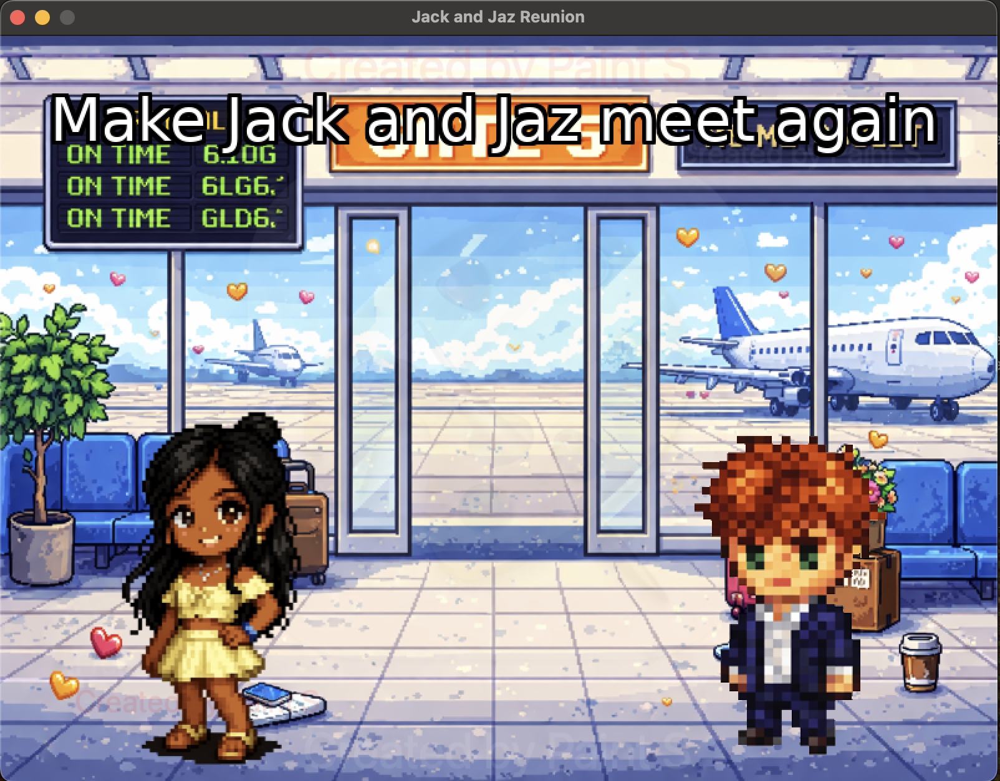

# **Lua exploration with LOVE 2D Game Engine**



## Purpose
Exploring Lua in a small project while being a little lover girl

Thank you miffynoa for [cute, chill & cool girly nintendo ds music ♡](https://www.youtube.com/watch?v=CEDDSqGD50Q&list=RDCEDDSqGD50Q&start_radio=1)

## Demo
<video src="https://github.com/jasmimi/lua-jack-and-jaz-reunion/raw/feat/init/demo.mov" controls width="800"></video>

## To-do:
- [x] Generate background
- [x] Generate jack with clear back
- [x] Generate jaz with clear back and same pixel art
- [x] Add cute background noise
- [x] When same index, heart transition to...
- [x] New screen saying "I've missed you too!"

## Run steps
1. run ```brew install love```
2. navigate project root
3. run ```love .```

[Distribution notes](
https://love2d.org/wiki/Game_Distribution#Creating_a_macOS_Application)

yes i did use one branch. this is a tiny game